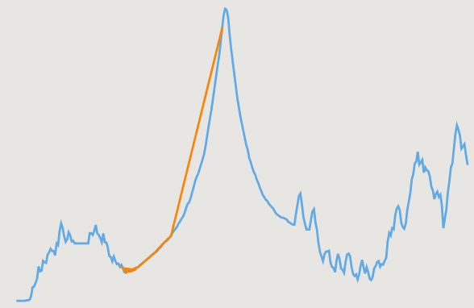

<!-- icons  -->
[1.1]: https://img.shields.io/badge/GitHub-100000?style=for-the-badge&logo=github&logoColor=white
[2.1]: https://img.shields.io/badge/LinkedIn-0077B5?style=for-the-badge&logo=linkedin&logoColor=white
[3.1]: https://img.shields.io/badge/Medium-12100E?style=for-the-badge&logo=medium&logoColor=white
[4.1]: https://img.shields.io/badge/Twitter-1DA1F2?style=for-the-badge&logo=twitter&logoColor=white

<!-- links to your social media accounts -->
[1]: https://github.com/produdez
[2]: https://www.linkedin.com/in/produdez/
[3]: https://medium.com/@produde
[4]: https://twitter.com/_Produde_

# Diver ML Course Assignments

    

**Description:**

This repository host all the notebooks that I wrote during the time I participate in Diver's machine learning course. Which includes:

- Basic ML concepts
- Data analysis
- Re-implementation of most ML methods
- Re-implementation of some Neural Network models
- Re-implementation of some Neural network structures

Final graduation project is a separate repo that can be found [here](https://github.com/produdez/poe-economy)

## Curriculum

**What is learnt each week? (summary)**

- Week 1: Python Introduction
- Week 2: Matrix product and gradient decent
- Week 3: Data Analysis
- Week 4: Classification with sklearn
- Week 7: Machine learning flow, model selection with grid search
- Week 8: Reimplement train-test-split
- Week 9: Reimplement linear regression
- Week 10: Reimplement logistic regression
- Week 11: Reimplement SVM
- Week 12: Reimplement decision tree
- Week 13: Reimplement K-mean
- Week 14: Reimplement ensemble methods (blend/bag/stack)
- Week 15: Reimplement simple neural network
- Week 16: Reimplement general neural network
- Week 17: Reimplement convolution neural network 1D
- Week 18: Reimplement convolution neural network 2D
- Week 19: Introduction to tensorflow
- Week 20: Introduction to keras
- Week 21: Just reading a research paper and write report
- Week 22: Review more research papers
- Week 23: Trying out a model (Faster R-CNN) from some one else's implementation
- Week 24: Image altering to expand image dataset
- Week 25: Try U-net's pre-implementation
- Week 26: Use keras's ResNet-50 and VGG-16 and implement them in a U-net architecture
- Week 27: Introduction to NLP
- Week 28: Reimplement Recurrent Neural Network
- Week 29: Comparison of keras's RNN, LSTM and GRU
- Week 30: Transfer learning with Seq-to-seq model
- Week 31: No code
- Week 32: Final project (different repo)

# Technologies Used

- Python
- Numpy
- Sklearn
- Matplotlib
- Pandas
- Seaborn
- Tensorflow
- Keras
- OpenCV
- ...

## Screenshots

Interesting graphics

1. Different clustering results from different initial conditions (Week 13)
    |||
   |---|---|

2. Training result of my 2D CNN (Week 18)
    
    

3. Kernel trick on SVM (Week 11)
    
    
4. Gradient decent
    
    | Too slow | Too fast | Good|
   |---|---|---|
    |||
## Setup

Requirements and Installations:

1. Python
2. Some notebooks require specific Python libraries so be warned!

## Usage

1. Just clone this repository
2. And run the notebooks
3. [Note] (some notebook need dataset) that's not available here.

## Acknowledgements

- Many thanks to the mentors **`(Diop-san and Cedrick-san)`** from Diver for supporting me

## Contact

Created by [@produdez](https://github.com/produdez) - feel free to contact me or follow my blog on medium ❤️!

<!-- [![alt text][1.1]][1] -->
[![alt text][2.1]][2]
[![alt text][3.1]][3]
[![alt text][4.1]][4]
